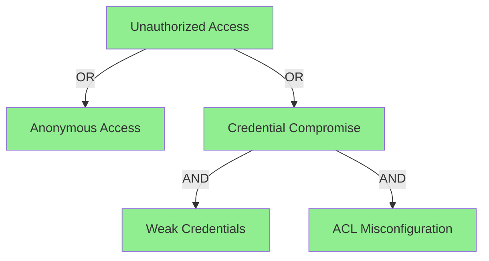

# Kraken

Kraken is a security testing tool that orchestrates scanners and execution
modules against network and industrial targets. The core binary focuses on
target discovery, orchestration, and reporting. Modules receive the target and
user-supplied parameters and own the actual testing logic, which makes Kraken
flexible enough to run anything.

Kraken supports two target types:

- **Network targets** (host:port pairs) - discovered via nmap
- **EtherCAT targets** (slave devices) - discovered via Layer 2 enumeration

## Architecture

A Kraken run follows four stages:

1. `internal/adapter/yamlconfig` loads `campaign.yaml` plus the optional attack
   trees definition.
2. `internal/scanner` classifies targets (for `network` campaigns) using the
   configured scanners (nmap for network discovery, EtherCAT for industrial
   device enumeration) and annotates each target with protocol/device tags.
3. `internal/runner` executes all tasks against every classified target. It
   routes work to the appropriate executor adapter: native Go modules,
   dynamically loaded ABI plugins, CLI binaries, Docker containers, or gRPC
   stubs.
4. `internal/adapter/jsonreport` writes `report.json` and the attack tree
   evaluator checks whether any attacker objective is satisfied.

The high-level component diagram for these stages is defined in
`component.puml` and rendered inside this document using PlantUML.


## Campaign

Kraken is configured with a YAML campaign file. A campaign describes how Kraken
should behave (network discovery vs. fuzzing), which modules to run, and how to
report the results.

### General options

```yaml
id: "iot-standard"
version: "2.0.0"
type: "network" # network (default) or fuzz

name: "IoT Network Assessment"
description: |
    General description of the campaign, what it does, etc...

attack_trees_def_path: "./trees/iot.yaml"
```

`type: fuzz` skips the network scanner entirely and runs the tasks as
stand-alone fuzzers. This mode exists so teams can keep long-running fuzzing
jobs (AFL++, libFuzzer harnesses, etc.) under the same
campaign format and reporting stack, even when the targets are binaries or
protocol parsers instead of reachable services. Network campaigns require CIDRs
through the `--cidrs` flag, whereas fuzzing campaigns do not.

### Policy configuration

Kraken enforces **safety-by-default** for OT/IoT environments. The `policy`
section controls safety constraints and runner behavior:

```yaml
policy:
    safety:
        allow_aggressive: false # Reject tasks marked aggressive
        require_max_duration: true # All tasks must specify max_duration

    runner:
        max_parallel_targets: 4 # Concurrent target limit

        defaults: # Connection defaults for OT safety
            connection_timeout: 10s
            connection_backoff: 100ms
            max_reconnects: 3
            max_connections_per_target: 1
```

#### Safety policy

The `safety` section controls OT-safety enforcement:

| Option                 | Default | Description                                    |
| ---------------------- | ------- | ---------------------------------------------- |
| `allow_aggressive`     | `false` | Permit tasks marked `aggressive: true` to run  |
| `require_max_duration` | `true`  | Reject tasks that don't specify `max_duration` |

**What makes a task aggressive?**

A task is aggressive if it may cause device disruption:

- Connection churn (rapid connect/disconnect)
- Malformed packets (can crash parsers)
- High-frequency polling (overwhelms device CPU)
- Fuzzing (intentionally sends invalid data)
- Write operations (may trigger physical actuation)
- Protocol violations (unexpected states may hang devices)

Tasks declare their nature with the `aggressive` flag:

```yaml
tasks:
    # Safe task (default)
    - id: mqtt-auth-check
      max_duration: 60s
      exec: { ... }

    # Aggressive task - requires allow_aggressive: true
    - id: mqtt-fuzzer
      max_duration: 300s
      aggressive: true
      exec: { ... }
```

#### Runner policy

The `runner` section controls execution behavior:

| Option                 | Default | Description                          |
| ---------------------- | ------- | ------------------------------------ |
| `max_parallel_targets` | `1`     | Maximum concurrent target processing |

Kraken always serializes module steps for the same host/port to avoid
overwhelming OT devices.

#### Connection defaults

The `defaults` section applies OT-safe connection behavior to all tasks:

| Option                       | Default | Description                             |
| ---------------------------- | ------- | --------------------------------------- |
| `connection_timeout`         | `10s`   | Dial timeout for new connections        |
| `connection_backoff`         | `100ms` | Delay between connection retry attempts |
| `max_reconnects`             | `3`     | Maximum retry attempts on dial failure  |
| `max_connections_per_target` | `1`     | Concurrent connections per target       |

These defaults are enforced at the conduit layer with automatic retry logic
and backoff to prevent connection storms on sensitive industrial devices.

#### Example: Production vs Lab

**Production (safe mode - default):**

```yaml
policy:
    safety:
        allow_aggressive: false
        require_max_duration: true
    runner:
        max_parallel_targets: 2
        defaults:
            connection_timeout: 10s
            max_reconnects: 3
```

**Lab/testing (aggressive permitted):**

```yaml
policy:
    safety:
        allow_aggressive: true # Permit fuzzing
    runner:
        max_parallel_targets: 8 # Higher parallelism OK in lab
```

### Scanner configuration

Scanner options are only used for `network` campaigns. Kraken supports multiple
scanner types that can be combined in a single campaign.

#### Multi-scanner configuration (recommended)

The `scanners` field accepts a list of scanner configurations. Each scanner
runs independently, and results are merged before module execution:

```yaml
scanners:
    - type: nmap
      nmap:
          open_only: true
          skip_host_discovery: false
          enable_udp: false
          service_detect:
              enabled: true
              version: "ALL"
          min_rate: 100
          timeout: 30m
          timing: T3
          ports:
              - "1883,8883,8083,8084,80,443,8000,8080,8443,8888,502,4840,554,8554"

    - type: ethercat
      ethercat:
          iface: "eth0"
          timeout: 10s
```

#### Legacy single scanner (deprecated)

The `scanner` field (singular) is still supported for backward compatibility.
This is equivalent to a single nmap scanner and will be removed in a future version.

#### Nmap scanner

The nmap scanner wraps `github.com/Ullaakut/nmap` for IP-layer discovery:

| Option                   | Description                       |
| ------------------------ | --------------------------------- |
| `open_only`              | Only report open ports            |
| `skip_host_discovery`    | Skip ping, scan all targets (-Pn) |
| `enable_udp`             | Include UDP scan                  |
| `service_detect.enabled` | Enable service version detection  |
| `service_detect.version` | `ALL` or `LIGHT`                  |
| `min_rate`               | Minimum packet rate               |
| `timeout`                | Scan timeout                      |
| `timing`                 | Nmap timing template (T0-T5)      |
| `ports`                  | Port specification list           |
| `iface`                  | Network interface to use          |

The nmap scanner tags each open service (e.g. `protocol:mqtt`, `supports:tls`),
and these tags are later matched against the modules' `required_tags`.

#### EtherCAT scanner

The EtherCAT scanner performs Layer 2 slave enumeration on industrial networks:

```yaml
scanners:
    - type: ethercat
      ethercat:
          iface: "eth0" # Required: network interface
          timeout: 10s # Optional: scan timeout
```

The EtherCAT scanner:

1. Sends broadcast datagrams (BRD) to count slaves on the segment
2. Reads device identity from each slave's EEPROM (vendor ID, product code, revision, serial)
3. Queries port status (DL Status register) to determine topology
4. Performs vendor database lookup for human-readable names

**Generated tags for EtherCAT targets:**

| Tag                             | Description                             |
| ------------------------------- | --------------------------------------- |
| `protocol:ethercat`             | Always present                          |
| `vendor:<name>`                 | Vendor name (e.g., `vendor:beckhoff`)   |
| `vendor:0x<id>`                 | Raw vendor ID if name unknown           |
| `product:0x<code>`              | Product code                            |
| `port:X:open` / `port:X:closed` | Port link status (X = 0-3)              |
| `topology:endpoint`             | Single upstream connection              |
| `topology:passthrough`          | Two connections (linear topology)       |
| `topology:junction`             | Three+ connections (star/tree topology) |

### Tasks configuration

Tasks describe which modules Kraken should run. Each task defines:

- `id`: unique name.
- `type`: one of `native`, `lib`, `cli`, `grpc`, or `fuzz`.
- `required_tags`: optional list of tags that must be present on a target.
- `max_duration`: optional timeout enforced by the runner.
- `exec`: execution-specific block (ABI, CLI, Docker, gRPC, parameters, etc.).

```yaml
tasks:
    - id: "mqtt-dict-native"
      type: native
      required_tags: ["protocol:mqtt"]
      max_duration: 30s
      exec:
          params:
              credentials_file: "./wordlists/mqtt.txt"

    - id: "lib-module-v1"
      type: lib
      required_tags: ["supports:tls", "protocol:tcp"]
      exec:
          abi:
              api: v1
              library_path: "/path/to/lib.so"
              symbol: kraken_run
          params:
              tls_insecure: true

    - id: "lib-module-v2"
      type: lib
      required_tags: ["supports:tls", "protocol:tcp"]
      exec:
          abi:
              api: v2
              library_path: "/path/to/lib.so"
              symbol: kraken_run_v2
          conduit:
              kind: 1
              stack:
                  - name: tcp
                  - name: tls
                    params:
                        skip_verify: true

    - id: "ethercat-module"
      type: lib
      required_tags: ["protocol:ethercat"]
      exec:
          abi:
              api: v2
              library_path: "/path/to/ethercat_module.so"
              symbol: kraken_run_v2
          conduit:
              kind: frame

    - id: "cli-module"
      type: cli
      required_tags: ["protocol:mqtt"]
      exec:
          cli:
              exec: "/path/to/exec"
              command: "scan"
          params:
              --test-case-index: "10-20"

    - id: "docker-fuzzer"
      type: fuzz
      exec:
          docker:
              runtime: "podman"
              image: "example/fuzzer:latest"
              mounts:
                  - host_path: "./seeds"
                    container_path: "/work/seeds"
                    read_only: true

    - id: "grpc-module"
      type: grpc
      required_tags: ["protocol:mqtt"]
      exec:
          grpc:
              server_addr: 127.0.0.1:5053
              dial_timeout: 30s
          params:
              key1: value1
```

Modules can be arbitrarily combined in a campaign. Kraken filters the list for
each target based on tag requirements and then executes the filtered plan.

## Modules

### Native modules

Native modules are implemented in Go and compiled into the Kraken binary (see
`internal/modules`). They expose their capabilities through `type: native` tasks
and can be listed with `kraken --native-modules`. Native modules accept per-run
configuration from `exec.params` and automatically receive the conduit stack
defined in their native descriptor.

### Library (ABI) modules

Library modules are shared libraries loaded via the Kraken Module ABI. Two ABI
versions are supported:

- **v1**: The module establishes its own transport (TCP, TLS, etc.) and manages
  all I/O.
- **v2**: **IMPORTANT:** Kraken owns the transport stack and injects a conduit handle into the
  module. The `conduit` block specifies the stack (e.g. TCP+TLS) and the kind
  (`kind: 1` for stream, `kind: 2` for datagram). V2 greatly simplifies modules
  but currently only supports a single connection per execution.

Transports available today are:

- `tcp`/`tls` for stream conduits (network targets)
- `udp`/`dtls` for datagram conduits (network targets)
- `frame` for Layer 2 conduits (EtherCAT targets)

**Conduit kind values**: The `kind` field accepts both string and numeric values:

- `kind: stream` or `kind: 1` for stream-oriented conduits (TCP, TLS)
- `kind: datagram` or `kind: 2` for datagram-oriented conduits (UDP, DTLS)
- `kind: frame` or `kind: 3` for frame-oriented conduits (raw Ethernet)

String values are recommended for clarity.

### CLI modules

CLI modules run an external executable on the same machine as Kraken. The CLI
adapter automatically appends `--host`, `--port`, and `--output-dir` (when
available) plus any key/value pairs found in `exec.params`. Module output must
be a `domain.RunResult` JSON document printed to stdout. CLI modules are
available for both `type: cli` and `type: fuzz` tasks (the runner omits the
target information for fuzzers).

### Docker modules

CLI/fuzz tasks can also specify a `docker` execution block. Kraken runs the
container using the configured runtime (defaults to `podman`) and expects the
container to emit a `domain.RunResult` JSON payload on stdout. Bind mounts can
be declared under `mounts` to pass seeds, wordlists, or output directories into
the container.

### gRPC modules

gRPC modules allow offloading execution to a remote host. The adapter dials
`exec.grpc.server_addr` with an optional `dial_timeout` and streams the target
information together with module parameters.

### Fuzz modules

Fuzz campaigns (`type: fuzz`) still use the CLI and Docker adapters but skip
the scanning phase entirely. The runner injects a placeholder target
(`host: <campaign id>`, `port: 0`), so fuzzers should rely solely on the params
and their mounted assets. This specialized campaign type keeps fuzz orchestration
alongside the rest of Kraken (results are still saved in the same format, attack
trees can still reason about findings) while decoupling the work from network
discovery. It is ideal for AFL++ harnesses, coverage-guided
fuzzer, or any other long-running fuzzing workflow.

## Attack Tree Evaluation

Attack trees model adversarial objectives as hierarchical goal structures. Kraken evaluates these trees against campaign findings to determine which attack paths are feasible.

### Tree Structure

Attack trees are defined in YAML with three node types:

- **LEAF nodes**: Reference specific finding IDs from modules
- **OR nodes**: Satisfied if any child succeeds
- **AND nodes**: Satisfied only if all children succeed

### Example Attack Tree

```yaml
- name: "Unauthorized Access"
  type: OR
  children:
      - name: "Anonymous Access"
        type: LEAF
        finding_ids: ["MQTT-ANON", "MQTT-PUBSUB-ANON"]
        finding_mode: any

      - name: "Credential Compromise"
        type: AND
        children:
            - name: "Weak Credentials Exist"
              type: LEAF
              finding_ids: ["DEFAULT-CREDENTIALS"]
              finding_mode: any

            - name: "ACL Misconfiguration"
              type: LEAF
              finding_ids: ["MQTT-ACL-PUB", "MQTT-ACL-SUB"]
              finding_mode: any
```

### Finding Modes

LEAF nodes support three finding modes:

- `any`: Node succeeds if at least one finding_id is present
- `all`: Node succeeds only if all finding_ids are present
- `threshold`: Node succeeds if a minimum number of findings are present (requires `finding_threshold` field)

### Evaluation Process

1. Kraken collects all findings from module executions
2. For each target, the attack tree is evaluated:
    - LEAF nodes check if their finding IDs are present
    - OR nodes succeed if any child succeeds
    - AND nodes succeed only if all children succeed
3. Results are written to `attack-trees/{host}_{port}.md` with Mermaid diagrams
4. A summary is generated in `attack-trees/summary.md`

### Mermaid Graph Generation

Successful attack paths are visualized using Mermaid flowcharts:



Nodes are color-coded:

- **Green**: Attack path succeeded
- **Red**: Attack path blocked
- **Gray**: Not evaluated

### Attack Tree Configuration

Specify the attack tree file in your campaign:

```yaml
attack_trees_def_path: "./trees/iot.yaml"
```

The path is relative to the campaign file location.
