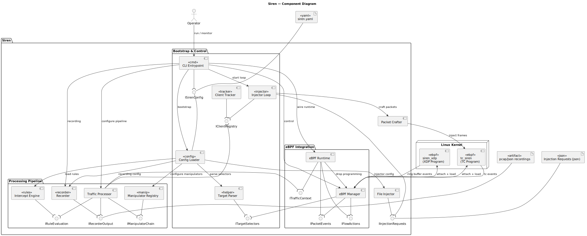

# Siren System Requisites

This document describes the functional and non-functional requirements for Siren.

## Architecture Overview

---

## 1. High-Level Requirements

### 1.1 Core Functionality

- **HL-F1** — Siren shall transparently intercept and analyze L2–L4 traffic on a
  designated Linux interface without requiring topology changes.
- **HL-F2** — Siren shall rely on an eBPF pipeline (XDP + TC + socket hooks) to
  observe, rewrite, mirror, or drop packets at line rate.
- **HL-F3** — Siren shall evaluate YAML rules and apply actions such as
  `drop`, `rewrite`, `delay`, `throttle`, `duplicate`, `inject`, and `log`.
- **HL-F4** — Siren shall allow user-defined manipulators written in Go to extend
  the built-in actions.
- **HL-F5** — Siren shall record intercepted traffic plus rule decisions in at
  least one structured format (PCAP or JSONL) for offline analysis.
- **HL-F6** — Siren shall optionally hook TLS/SSL functions to mirror plaintext
  buffers (keys or decrypted payloads) without handling private certificates.

### 1.2 Operator Experience

- **HL-U1** — Siren shall be configured through a single YAML _playbook_ that
  covers targets, pipelines, recording, and rules.
- **HL-U2** — Siren shall run as a standalone CLI binary that requires `sudo`
  (or equivalent capabilities) to attach its eBPF programs.
- **HL-U3** — Siren shall expose an optional REST API for runtime inspection or
  hot-swapping of rules and recording settings.

### 1.3 System Qualities

- **HL-Q1** — Siren shall keep per-packet latency overhead below 10 µs in
  userspace by delegating enforcement to the kernel whenever possible.
- **HL-Q2** — Siren shall be delivered as a self-contained binary that only
  depends on a compatible Linux kernel (≥ 5.4) and standard tooling.
- **HL-Q3** — Potentially sensitive features (e.g., TLS interception, packet
  injection) shall be opt-in and disabled by default.
- **HL-Q4** — Deployment shall avoid complex prerequisites such as `iptables`
  rewrites or `LD_PRELOAD` tricks; selecting an interface is sufficient.

---

## 2. Low-Level Requirements

### 2.1 General

- **LL-G1** — The CLI shall accept `-config <path>` to load a playbook.
- **LL-G2** — The YAML schema shall be versioned and documented, covering eBPF
  attachment, TLS providers, targets, rules, manipulators, and recording.

### 2.2 eBPF Engine (SRN-EBPF)

#### 2.2.1 Architectural Requirements

- **SRN-EBPF-A1** — An XDP program shall provide read access to ingress packets
  and enforce immediate drops.
- **SRN-EBPF-A2** — A TC clsact program shall provide rewrite/inject capabilities
  on both ingress and egress directions.
- **SRN-EBPF-A3** — Socket/cgroup programs shall emit per-flow metadata (state,
  latency).
- **SRN-EBPF-A4** — A ring buffer (or similar channel) shall transfer packet
  metadata/payload slices to userspace.
- **SRN-EBPF-A5** — BPF maps shall receive enforcement
  instructions such as drop, rewrite window, or throttle budget.

#### 2.2.2 Functional Requirements

- **SRN-EBPF-F1** — The XDP program shall filter packets based on a target map
  (IP, MAC, IP:Port, EtherCAT, labels). Empty maps imply “capture all.”
- **SRN-EBPF-F2** — TC hooks shall apply rewrite/inject directives referenced by
  ID, supplied by userspace.
- **SRN-EBPF-F3** — Socket hooks shall pace or mirror flows when instructed by
  the rule engine.
- **SRN-EBPF-F4** — Userspace shall manage the lifecycle of every loaded program
  (load, attach, detach, reload).

#### 2.2.3 Non-Functional Requirements

- **SRN-EBPF-N1** — All programs shall support Linux kernels ≥ 5.4.
- **SRN-EBPF-N2** — Precompiled objects shall be embedded into the Go binary.
- **SRN-EBPF-N3** — `go generate ./siren/ebpf` shall rebuild every object via
  `clang -target bpf`.

### 2.3 TLS Instrumentation (SRN-TLS)

- **SRN-TLS-A1** — Siren shall support optional uprobes/uretprobes on userland
  TLS libraries (OpenSSL, BoringSSL, etc.).
- **SRN-TLS-F1** — When enabled, plaintext buffers from `SSL_read`/`SSL_write`
  (or equivalent) shall be forwarded to the rule engine.
- **SRN-TLS-F2** — TLS providers shall be whitelisted in the YAML playbook by
  library path and symbol names.
- **SRN-TLS-N1** — If TLS instrumentation is disabled or a provider is missing,
  Siren shall continue operating on clear text flows normally and should skip
  ciphertext to avoid wasting resourcers analyzing encrypted data.

### 2.4 Intercept Engine (SRN-INT)

#### 2.4.1 Architectural Requirements

- **SRN-INT-A1** — The intercept engine shall receive traffic contexts from the
  eBPF pipeline and enrich them with rule metadata.
- **SRN-INT-A2** — The engine shall evaluate matchers first, then hand off to
  manipulators before emitting the final action.

#### 2.4.2 Functional Requirements

- **SRN-INT-F1** — Matchers shall include direction, payload regex, byte ranges,
  protocol/port, and custom tags.
- **SRN-INT-F2** — Actions shall include `drop`, `rewrite`, `delay`, `duplicate`,
  `mirror`, `throttle`, `inject`, and `log`.
- **SRN-INT-F3** — Actions backed by kernel enforcement (drop/rewrite/throttle)
  shall be reflected in the appropriate BPF maps; remaining actions shall run in
  userspace or manipulators.
- **SRN-INT-F4** — Rules shall be hot-swappable via the REST API without
  restarting the binary.

### 2.5 Recorder (SRN-REC)

#### 2.5.1 Functional Requirements

- **SRN-REC-F1** — The recorder shall capture every intercepted packet to at
  least one destination (PCAP, JSONL).
- **SRN-REC-F2** — Recording shall be controlled through the YAML playbook and
  adjustable via the REST API.

#### 2.5.2 Non-Functional Requirements

- **SRN-REC-N1** — Recording shall avoid blocking the interception loop; buffering
  or asynchronous writes shall be used to keep overhead negligible.
